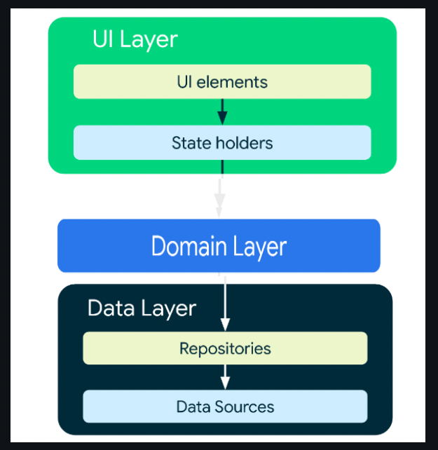
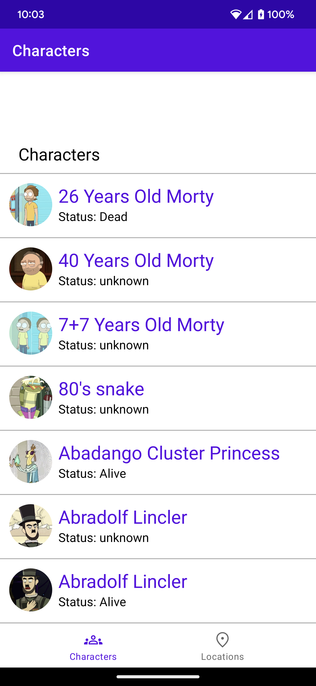
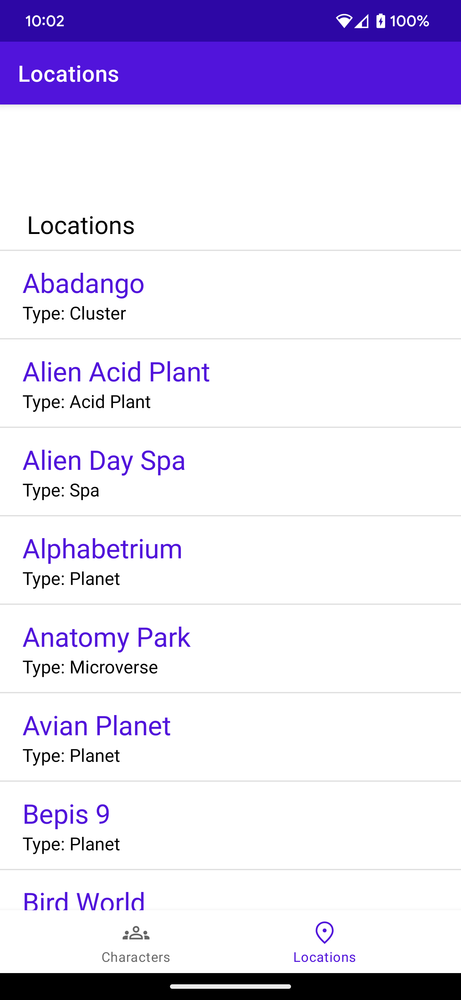
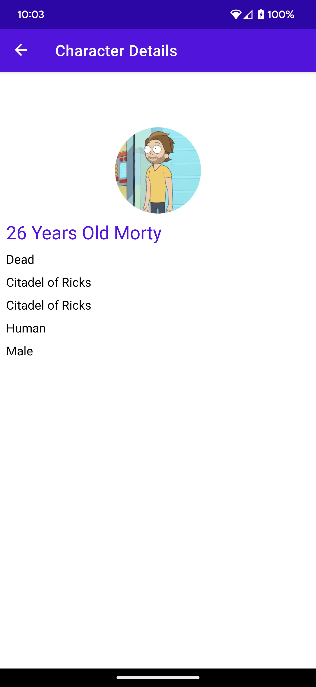

# RickAndMorty

RickAndMorty is a Android application which helps you to browse the Characters and locations of RickAndMorty. Its a work in progress app, so please 
don't expect too much in the UI of this Android application ATM. Once you click a character it will take you to character information.

Tech Stack used -

* User Interface built with **[Android Constraint Layouts](https://developer.android.com/develop/ui/views/layout/constraint-layout)**
RecyclerView **[Android RecyclerViews](https://developer.android.com/develop/ui/views/layout/recyclerview)**
* A single-activity architecture,
  using **[Navigation Components](https://developer.android.com/guide/navigation/navigation-getting-started)**.
* A UI layer that contains a Activity, Fragments, Layouts (View) and a **ViewModel** per screen (or
  feature).
* Reactive UIs using **[Flow](https://developer.android.com/kotlin/flow)**
  and **[coroutines](https://kotlinlang.org/docs/coroutines-overview.html)** for asynchronous
  operations.
* A **data layer** with a use case, repository and two data sources (local using Room and remote).
* Dependency injection
  using [Hilt](https://developer.android.com/training/dependency-injection/hilt-android).

Architecture 

Used MVVM Clean architecture which Google andorid docs recommend, (the below content and screenshots are fetched from Android developer docs)



UI layer
The role of the UI layer (or presentation layer) is to display the application data on the screen. Whenever the data changes, either due to user interaction (such as pressing a button) or external input (such as a network response), the UI should update to reflect the changes.

The UI layer is made up of two things:

UI elements that render the data on the screen which is been build Layouts, Fragments, Activities.
State holders (such as ViewModel classes) that hold data, expose it to the UI, and handle logic.

Data layer
The data layer of our app contains the business logic, which is made of repositories and data sources either its a remote or local

Domain layer
The domain layer is an optional layer that sits between the UI and data layers.


## Screenshots





## Opening a sample in Android Studio

Clone the repository:
```
git clone git@github.com:Mahesh-Venkat/RickAndMorty.git
```

Finally import the `RickAndMorty/` directory in Android Studio.


## APIs Info

The default one that's been used is the first one

1. https://rickandmortyapi.com/api/character
2. https://rickandmortyapi.com/api/location
3. https://rickandmortyapi.com/api/character/{characterId}


